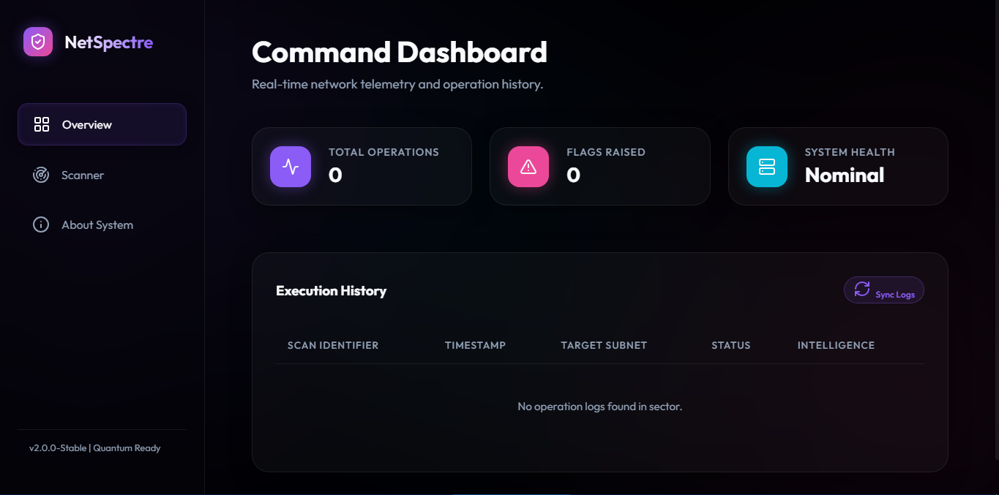
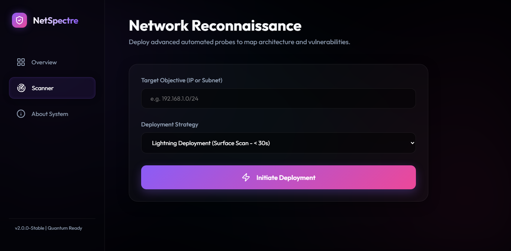
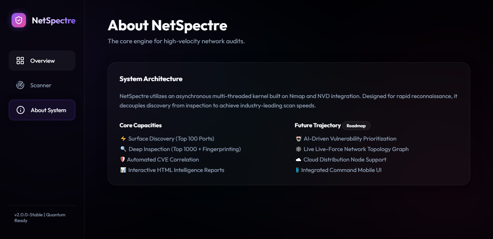

# 🌌 NetSpectre
### *Advanced Quantum-Ready Network Reconnaissance Engine*

NetSpectre is a high-performance network security tool designed for rapid discovery, port identification, and vulnerability correlation. It provides a sleek, modern, and interactive web dashboard featuring a stunning Glassmorphism UI.

---

## Preview 

1.


2.  


3.  


---

## 📖 Guided Documentation

Looking for more detail? Check out our visual guides:

*   [**Usage Guide**](USAGE.md) - Learn how to master the scanning modes.
*   [**Installation Guide**](USAGE.md#setup) - Detailed setup instructions for all platforms.

---

## 🚀 Quick Start (Zero to Scan)

Get NetSpectre up and running in less than 2 minutes.

1.  **Install Requirements** (Ensure you have [Nmap](https://nmap.org/download.html) installed on your system):
    ```bash
    pip install -r requirements.txt
    ```

2.  **Ignite the Engine**:
    ```bash
    python -m netspectre.app
    ```

3.  **Access the Dashboard**:
    Open [http://localhost:5000](http://localhost:5000) in your browser.

---

## ⚡ Key Features

*   🚀 **High-Velocity Scanning**: Sub-30s surface scans for rapid reconnaissance.
*   🛡️ **Vulnerability Correlation**: Automatic CVE lookup via NVD integration.
*   🎨 **Modern Design**: Crystal-clear Glassmorphism 2.0 interface.
*   📊 **Instant Reporting**: Professional HTML reports generated after every scan.
*   🛑 **Full Control**: Start, stop, and monitor scans in real-time.

---

## 📂 Project Architecture

```text
netspectre/
├── netspectre/                 # Core Engine
│   ├── app.py                  # Entry Point
│   ├── scanner.py              # Scanning Logic
│   └── web/                    # Dashboard Interface
├── reports/                    # Generated Intelligence
├── tests/                      # Reliability Tests
└── USAGE.md                    # Detailed Manual
```

---

## 🔮 Future Roadmap

*   **AI-Powered Triaging**: LLM-based analysis of vulnerabilities.
*   **Mesh Graphing**: Visualize your network topology in 3D.
*   **Distributed Scanners**: Deployable agents for multi-point reconnaissance.

---

## 📜 license & Legal

Distributed under the MIT License. Use responsibly.

*“Seeing through the network shroud.”*
